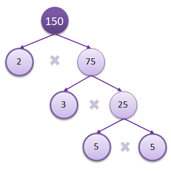

# Prime Factor Tree Algorithm

The Prime Factor Tree is a visual technique used in Maths to workout all the
prime factors of a large number.

With this approach, all the leaf nodes (nodes without sub-branches)
are the prime factors of the root node. For instance, with the above tree, the
prime factors of 150 are 2, 3, 5 and 5 again. In other words:

    150 = 2 x 3 x 5 x 5 = 2 x 3 x 52
